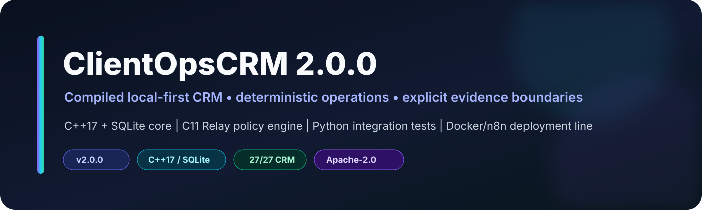
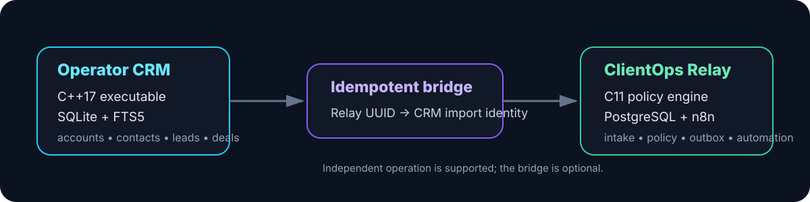

<p align="center">
  
</p>

<p align="center"><strong>Compiled local-first CRM with a verified native core and an independently runnable deterministic Relay subsystem.</strong></p>

<p align="center">
  <a href="docs/crm/01_OPERATOR_GUIDE.md">Operator Guide</a> ·
  <a href="docs/crm/02_ARCHITECTURE_AND_DATA_MODEL.md">Architecture</a> ·
  <a href="docs/crm/03_CLI_API_REFERENCE.md">CLI Reference</a> ·
  <a href="docs/crm/06_VERIFICATION_REPORT.md">Verification</a> ·
  <a href="docs/README.md">Documentation Index</a>
</p>

> **Fresh GitHub-preparation check:** the C++17 CRM passed all **27/27 integration checks** on GCC release, GCC debug, GCC ASan/UBSan, and an independent Clang build. The inherited C11 Relay policy engine also passed its policy, HTTP-boundary, build-parity, ASan, and UBSan gates. Optional portfolio rendering is **not** a release gate.

<p align="center">
  
</p>

---

# ClientOpsCRM 2.0.0

ClientOpsCRM is a compiled, local-first CRM built on the verified ClientOps Relay 1.2.1 intake and automation line. The operator CRM is a C++17 executable backed by SQLite; Relay remains the deterministic C11/PostgreSQL/n8n intake subsystem. The two can run independently or exchange Relay leads through an idempotent CSV stream bridge.

This release is intentionally CLI-only. It does not ship a mock UI, placeholder service, fake database, or simulated CRM backend.

## Implemented CRM surface

- accounts/organizations with normalized domains and ownership;
- contacts with account relationships, normalized email/phone identity, and ownership;
- leads with Relay ticket identity, qualification/disqualification, metadata, score and source provenance;
- atomic lead conversion into account/contact/deal records;
- configurable pipelines and ordered open/won/lost stages;
- deals with exact integer-minor-unit money, currency, probability, expected close, ownership and validated lifecycle transitions;
- tasks, notes and custom fields attached to CRM entities;
- SQLite FTS5 search;
- normalized duplicate signals;
- dashboard and weighted forecast views;
- entity timelines and a separate append-only mutation audit log;
- JSON and CSV export;
- RFC-style CSV lead import with idempotent Relay replay;
- integrity `doctor` with schema, foreign-key and business-invariant checks.

## Fast CRM start

Prerequisites: a C++17 compiler, GNU Make, `pkg-config`, SQLite development headers/library, and Python 3 for the integration tests.

```sh
make -C crm release
./crm/build/clientops-crm --db ./clientops-crm.db init
./crm/build/clientops-crm --db ./clientops-crm.db doctor
./crm/build/clientops-crm --db ./clientops-crm.db help
```

Or use the combined launcher. It builds the CRM when needed and creates a private local database under `runtime/` on first CRM operation:

```sh
./clientops crm doctor
./clientops crm dashboard
./clientops crm account add --name "Example Ltd" --domain example.com
./clientops crm contact add --first Ada --last Lovelace --email ada@example.com
./clientops crm lead add --name "Grace Hopper" --email grace@example.net --company "Compiler Labs"
```

Set `CLIENTOPS_CRM_DB=/path/to/file.db` to place the CRM database somewhere else.

## Verification

The permanent CRM integration suite creates a real SQLite database and invokes the compiled executable as a subprocess for every operation. It also bypasses the application layer for direct database adversarial checks.

```sh
make -C crm clean
make -C crm release debug sanitize
python3 crm/tests/test_crm.py
CRM_BIN=crm/build/clientops-crm-debug python3 crm/tests/test_crm.py
CRM_BIN=crm/build/clientops-crm-sanitize python3 crm/tests/test_crm.py
```

The finalized suite contains **27 checks**. The release was rerun successfully with GCC Release, GCC Debug, GCC ASan/UBSan, and an independent Clang 17 build. Clang static analysis completed with zero diagnostics. See `docs/crm/06_VERIFICATION_REPORT.md` and `evidence/crm/` for the exact evidence included in the release.

## Relay coexistence

The inherited Relay subsystem remains available at the project root:

```sh
./clientops setup owner@example.com UTC
./clientops up
./clientops verify
```

A running Relay PostgreSQL stack can be imported into the CRM through the real bridge:

```sh
./clientops crm-import-relay
```

Relay UUIDs become stable CRM import identities. Re-running the bridge is idempotent through `--skip-existing` rather than creating duplicate lead rows.

Relay's own `package.json` and `RELEASE_MANIFEST.json` retain the 1.2.1 subsystem identity so its existing tooling remains truthful. `CLIENTOPSCRM_VERSION` carries the combined release identity.

## Research basis

`research/research_sources.csv` contains **143 unique traceable sources**: the 77-source Relay corpus plus CRM, database, standards, security, academic and Nobel-prize material used to inform the CRM model. The research is a design evidence base, not copied vendor code or schema. See `research/RESEARCH_SYNTHESIS.md` and `research/CLAIM_SOURCE_LEDGER.csv`.

## Project map

```text
.
├── crm/                         # C++17 CRM, SQLite persistence, integration tests, Relay bridge
├── control/                     # hard rules, planner, task, delivery and engineering skills contract
├── research/                    # 143-source register, synthesis and claim ledger
├── evidence/crm/                # executable verification evidence
├── docs/crm/                    # operator/API/architecture/security/research/verification docs
├── clientops                    # combined launcher; Relay lifecycle + CRM entry points
├── policy-engine/               # inherited deterministic C11 Relay policy engine
├── database/                    # inherited Relay PostgreSQL schema/migrations
├── workflows/                   # inherited Relay n8n workflows
├── companion/                   # inherited authenticated Relay HTTP boundary
├── deploy/                      # inherited Relay deployment/edge assets
└── tests/                       # inherited Relay verification gates
```

## Documentation

Start with:

- `docs/crm/01_OPERATOR_GUIDE.md`
- `docs/crm/02_ARCHITECTURE_AND_DATA_MODEL.md`
- `docs/crm/03_CLI_API_REFERENCE.md`
- `docs/crm/04_RESEARCH_AND_GEN_FRAMEWORK.md`
- `docs/crm/05_SECURITY_AND_ADVERSARIAL_REVIEW.md`
- `docs/crm/06_VERIFICATION_REPORT.md`
- `docs/crm/07_GLOSSARY.md`
- `docs/crm/08_OPEN_SOURCE_RELEASE_GUIDE.md`

Matching LaTeX sources and rendered PDFs are included in the documentation release archive.

## License

ClientOpsCRM and the preserved ClientOps Relay source in this release are distributed under the Apache License 2.0, subject to the separate licenses/notices of included third-party components such as cJSON. See `LICENSE` and the third-party source metadata under `policy-engine/third_party/`.
