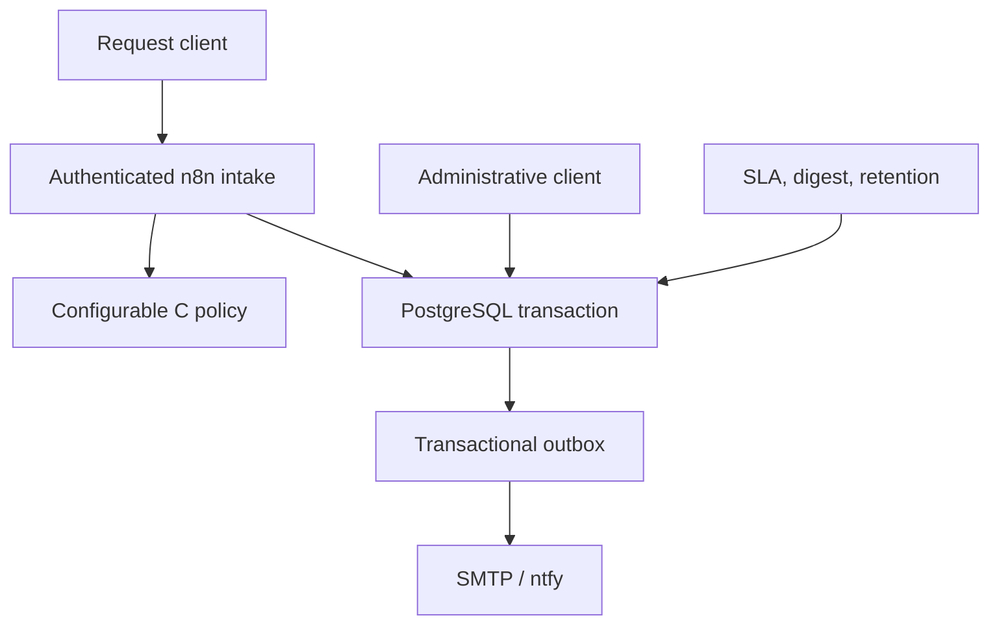

# Architecture

ClientOps Relay is a self-hosted request-intake and follow-up system. n8n orchestrates a deterministic C triage service, PostgreSQL stores business state and the delivery queue, Mailpit captures real local SMTP, and ntfy handles real local HTTP push.

The core requires no third-party credentials. Google Sheets, Slack, and Gmail are an optional inactive adapter with a separate verification boundary.

## Trusted edge layer

The deployment deliberately separates public transport security from the internal n8n listener. Traefik terminates HTTPS and forwards to `http://n8n:5678` on the private `edge` network. n8n generates externally correct links from `N8N_HOST`, `N8N_EDITOR_BASE_URL`, and `N8N_WEBHOOK_URL`; `N8N_PROXY_HOPS=1` means only the single Traefik hop is trusted. This avoids publishing n8n directly while preserving a plain internal service connection inside the container network.

The public route set is intentionally small: the two ClientOps webhooks are addressable at exact paths, and every other n8n path falls through to an editor route protected with Basic Auth. ClientOps API keys remain the application-level authority for intake and administrative state transitions; edge auth is an additional boundary for the interactive/editor surface rather than a replacement for API authorization.

## System boundary



Traefik is the sole host-facing application edge. In local mode it binds HTTPS only to `127.0.0.1:8443`; Mailpit and ntfy remain on loopback; n8n and PostgreSQL publish no host ports. Public mode explicitly switches the edge to ports 80/443, obtains TLS through ACME, sets n8n secure-cookie/public URL values, and fixes the trusted proxy depth to one. Exact webhook routes receive independent body/rate controls while the n8n editor and all other n8n routes additionally require generated edge authentication. The edge rejects aliased request-header names, sanitizes paths, applies a 64 KiB header ceiling, and uses an explicit TLS 1.2 minimum with strict TLS option handling.

## Universal triage model

The public request shape is stable. Internally, n8n calls `policy:8080/v2/qualify`, which returns policy version `clientops-triage-v1` and a generic decision:

```text
fit, fitReason, category, score, serviceable,
urgency, summary, nextStep, draftReply, route
```

The policy configuration controls:

- named categories and keyword sets;
- which categories require specialist handling;
- an optional fallback category;
- high/low urgency keywords;
- spam and exclusion keywords;
- minimum detail words;
- `any` location mode or a case-insensitive allowlist.

The default `any` mode treats all regions as serviceable and needs no `city`. Allowlist mode can send unknown/unlisted locations to `ROUTE_LOCATION_REVIEW`. Phone normalization preserves an explicit leading `+` but never guesses a country code.

Route precedence is deterministic:

1. spam;
2. insufficient detail;
3. configured exclusion or no fallback;
4. ambiguous category;
5. location review;
6. urgent;
7. specialist;
8. standard.

Category ties become manual review. There is no model call, measurement parser, price estimate, or regional default hidden in the binary.

## Request and delivery flow

1. `POST /webhook/clientops/leads` is authenticated with the intake-only credential.
2. A Code node rejects an invalid key/body, unknown fields, missing consent, malformed data, and oversized input.
3. n8n calls `/v2/qualify` with a five-second HTTP timeout and bounded retries.
4. The policy response must be successful, version-compatible, complete, and type-safe.
5. `clientops.ingest_lead(...)` creates the request, accepted activity, and initial delivery rows in one transaction.
6. The webhook returns only after that function commits.
7. The dispatcher claims ready rows, authorizes each lease immediately before sending, then completes or defers that exact lease.

If policy or persistence is unavailable, intake returns `503` and the caller can retry the same body and idempotency key.

### Core workflows

| Workflow | Trigger | Database operation | Effect |
| --- | --- | --- | --- |
| 01 — API Request Intake | authenticated POST | `ingest_lead` | validate, triage, atomically accept, queue initial delivery |
| 20 — Outbox Dispatcher | minute/manual | claim, authorize, complete/fail | deliver up to 20 ready rows |
| 30 — SLA Monitor | five minutes/manual | `schedule_due_followups` | queue due alerts |
| 40 — Daily Digest | 17:00/manual | `enqueue_daily_digest` | queue one digest per business date |
| 50 — Mark Contacted | authenticated POST | `mark_lead_contacted` | record contact and cancel SLA work |
| 60 — Retention | 03:10/manual | `purge_expired_data` | purge expired business/failure data |
| 90 — Error Sink | n8n Error Trigger | `record_workflow_failure` | store bounded scalar failure metadata |

Workflow JSON omits a hardcoded timezone. n8n inherits `GENERIC_TIMEZONE`, and PostgreSQL stores the same validated `CLIENTOPS_TIMEZONE` for business-day calculations.

## Atomic acceptance and idempotency

`ingest_lead` inserts the request, accepted activity, and delivery jobs in a single PostgreSQL transaction. A failure rolls back the whole call.

The caller supplies an 8–128 character key from `[A-Za-z0-9._:-]`. The function:

- takes a transaction-scoped advisory lock keyed by the idempotency value;
- stores the normalized `canonical_request`;
- retains a digest as an index-friendly diagnostic;
- returns `200` and the original ticket for the same canonical request;
- returns `409` for changed canonical data under the same key.

Replay safety compares complete JSON, so it does not rely on digest collision resistance or repeatable explanatory wording from the policy.

## Priority and SLA mapping

| Route | Priority | Follow-up due |
| --- | --- | --- |
| `ROUTE_URGENT` | high | 15 minutes |
| `ROUTE_STANDARD`, `ROUTE_SPECIALIST` | medium | 2 hours |
| `ROUTE_INSUFFICIENT_INFORMATION`, `ROUTE_MANUAL_REVIEW` | low | 4 hours |
| spam, unsupported, location review | low | no SLA |

Spam is recorded but creates no delivery. Any non-spam decision with a draft reply queues an SMTP acknowledgement. A high-priority owner alert uses ntfy; other owner alerts use SMTP.

## Delivery leases, retry, and dead letters

`claim_outbox` uses `FOR UPDATE SKIP LOCKED`, priority ordering, a worker ID, and a fresh UUID lease token. Leases expire after five minutes. Completion/failure requires both the current worker and token, so a stale worker cannot mutate a reclaimed row.

Each SMTP/ntfy node may try three times one second apart. A failed durable database attempt follows:

| Attempt | Next state |
| --- | --- |
| 1 | pending in 1 minute |
| 2 | pending in 5 minutes |
| 3 | pending in 15 minutes |
| 4 | pending in 1 hour |
| 5 | pending in 4 hours |
| 6 | dead letter |

An expired lease can be reclaimed; an expired sixth lease becomes dead letter during a later claim pass.

### At-least-once boundary

Provider delivery is at least once, not exactly once. A provider call and database completion cannot share one transaction. If a provider accepts a message and the worker stops before completion, the recipient may see a duplicate. Lease fencing protects database state, not external side effects.

## Contact cancellation

The SLA scheduler selects due, still-new requests with row locking and queues at most one alert per ticket. Marking contacted is idempotent and cancels pending/leased SLA rows. `authorize_delivery` checks the ticket immediately before the channel node. A contact update can still lose the narrow authorization-to-send race because a committed authorization cannot retract a provider call already starting.

## Data model and retention

| Object | Purpose | Default retention |
| --- | --- | --- |
| `leads` | normalized request, generic decision, status, SLA timestamps | 90 days |
| `lead_activity` | accepted/contacted/delivery/SLA events | cascades with ticket |
| `delivery_outbox` | payload, state, lease, attempts, errors | 90 days; a live lease is kept only until expiry |
| `workflow_failures` | bounded workflow/node/execution/error metadata | 30 days |
| `settings` | destinations, timezone, retention configuration | not purged |
| `schema_migrations` | applied version/checksum | not purged |

An expired/stale old lease is purgeable; only a currently live lease is temporarily protected. Lead deletion cascades activity and nulls an associated outbox ticket reference if needed.

The workflow never passes an IP to the policy/database, the schema has no IP-derived column, and n8n execution-payload saving is disabled. Proxy, host, and platform logs added outside this deployment remain an operator responsibility.

## Database and workflow upgrades

`n8n-upgrade-preflight` starts after PostgreSQL health. It exports the fixed-ID workflows and encrypted credentials, writes and verifies a SHA-256 manifest over the copied backup, and refuses unrecognized customizations without importing, publishing, or changing a credential. `database-migrate` cannot start unless that preflight succeeds, and `n8n-init` cannot start until the migration completes. The migration obtains a transaction-scoped advisory lock, validates its recorded checksum, transforms legacy decision columns/routes, preserves IDs and historical raw JSON, removes legacy structured fields, and records `1.1.0`. Re-running it is a no-op over already-current data; `schema.sql` then reconciles current functions, grants, and constraints.

The n8n v2 install repeats the same guard after migration, recognizes untouched stock v1 fingerprints, replaces only those fixed-ID workflows, republishes them, and validates current semantics. A customized fixed-ID workflow causes a clear refusal and is not overwritten.

Rollback after the column migration is a paired restore of `.env`, PostgreSQL, and n8n volumes from the same maintenance window.

## Privilege and secret boundaries

| Role | Login | Authority |
| --- | --- | --- |
| `postgres` | yes | bootstrap and operator administration |
| `n8n` | yes | owns the separate n8n database |
| `clientops_owner` | no | owns ClientOps objects/security-definer routines |
| `clientops_app` | yes | use schema, read queue-health view, execute named functions only |

Application functions are `SECURITY DEFINER` with fixed `search_path`. Table/function privileges are revoked from `PUBLIC`; the runtime role cannot select business or migration tables. It receives only the delivery row returned by an approved claim.

Webhook keys, database passwords, the n8n encryption key, and runner token live in the mode-`0600` `.env`. Imported n8n credentials are encrypted. Code-node environment access is blocked, command/filesystem nodes are excluded, unverified packages are disabled, and the SSRF allowlist admits only the internal policy and ntfy hostnames used by checked-in HTTP nodes.

## Optional adapter boundary

[`workflows/adapters/google-sheets-slack-gmail.json`](../workflows/adapters/google-sheets-slack-gmail.json) is inactive, unconnected, contains no OAuth credentials, and is import-validated only. It validates generic decision fields, writes RAW spreadsheet values with formula neutralization, upserts by ticket UUID, escapes Slack markup controls, and sends a generic Gmail acknowledgement. Slack/Gmail remain at-least-once calls.

It must not be presented as live-integrated until real credentials pass the [adapter checklist](adapters.md#live-checklist).

## Source map

| Concern | Authoritative source |
| --- | --- |
| topology, pins, ports, privacy | [`compose.yaml`](../compose.yaml) |
| tables, functions, grants | [`database/schema.sql`](../database/schema.sql) |
| upgrade transform | [`database/migrations/002-universal-v1.1.sql`](../database/migrations/002-universal-v1.1.sql) |
| universal configuration | [`policy-engine/config/policy.json`](../policy-engine/config/policy.json) |
| generated workflow source | [`scripts/build-workflows.mjs`](../scripts/build-workflows.mjs) |
| native and black-box contracts | [`tests`](../tests) and [verification](verification.md) |

For examples and response envelopes, use the [API contract](api.md). For health, backup, upgrade, and recovery, use the [operations runbook](runbooks/operations.md).
